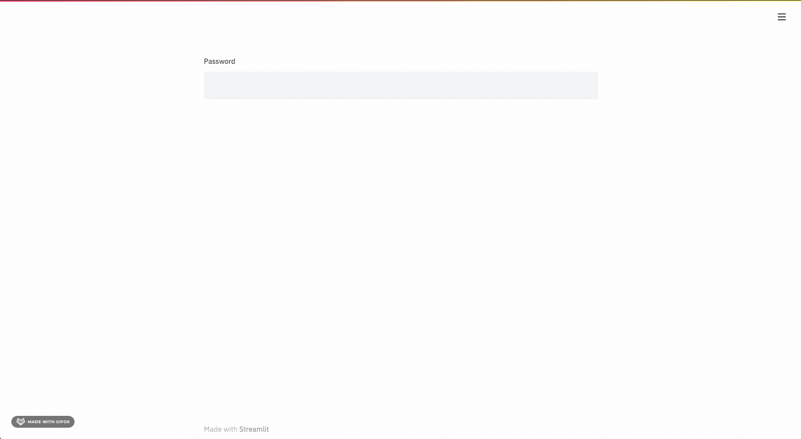

# Password-Protected Streamlit Dashboards

A small example showing how to hide a dashboard behind a trivial password-based single-user 
authentication.

> Please note that it is not a "real-world", production-ready approach to 
> protect access to your dashboards. It is just a very simple way to somehow 
> restrict access if running on a host with public IP.

## How It Works?

This example shows a password-input widget to ask user for a password and saves it 
as a part of Streamlit's session. The password is retrieved each time when the 
user interacts with the dashboard. However, each time when you refresh the dashboard
or restart it, the state is lost and password should be typed again.

## Example

Start Streamlit as the following command shows.
```
DASHBOARD_PASSWORD=123 python -m streamlit run main.py
```

Open a link printed to the terminal with your browser. Then you'll see a 
password-protected dashboard as the following GIF shows.




## References

1) [Discussion on Streamlit forum](https://discuss.streamlit.io/t/user-authentication/612/53)
2) [Hacking session state](https://gist.github.com/tvst/036da038ab3e999a64497f42de966a92)